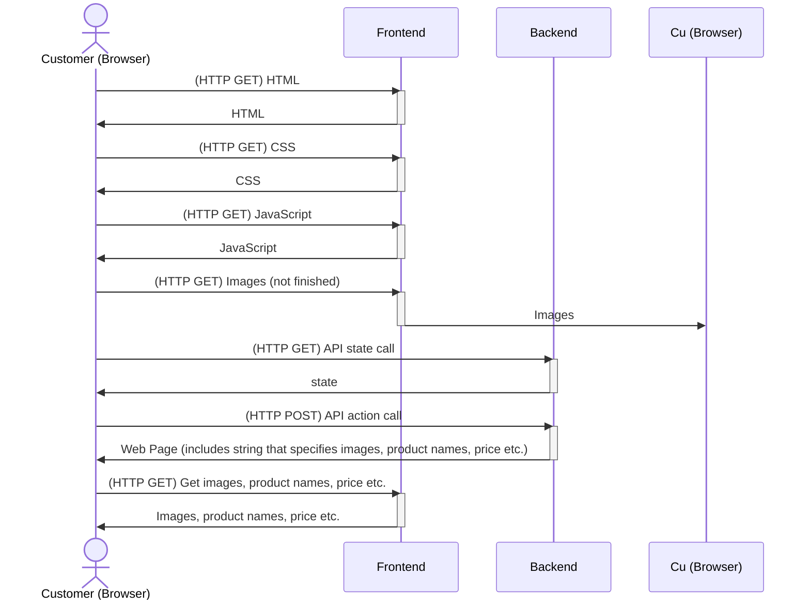

# Sequence Diagram

```mermaid

sequenceDiagram
  actor Customer (Browser)
  participant Frontend
  participant Backend

  Customer (Browser)->>Frontend: (HTTP GET) HTML
  activate Frontend
  Frontend->>Customer (Browser): HTML
  deactivate Frontend
  Customer (Browser)->>Frontend: (HTTP GET) CSS
  activate Frontend
  Frontend->>Customer (Browser): CSS
  deactivate Frontend
  Customer (Browser)->>Frontend: (HTTP GET) JavaScript 
  activate Frontend
  Frontend->>Customer (Browser): JavaScript
  deactivate Frontend
  Customer (Browser)->>Frontend: (HTTP GET) Images (not finished)
  activate Frontend
  Frontend->>Cu (Browser): Images
  deactivate Frontend


  Customer (Browser)->>Backend: (HTTP GET) API state call
  activate Backend

  Backend->>Customer (Browser):  state
  deactivate Backend

  Customer (Browser)->>Backend: (HTTP POST) API action call
  activate Backend

  Backend->>Customer (Browser): Web Page (includes string that specifies images, product names, price etc.)
  deactivate Backend

  Customer (Browser)->>Frontend: (HTTP GET) Get images, product names, price etc.
  activate Frontend

  Frontend->>Customer (Browser): Images, product names, price etc.
  deactivate Frontend
```