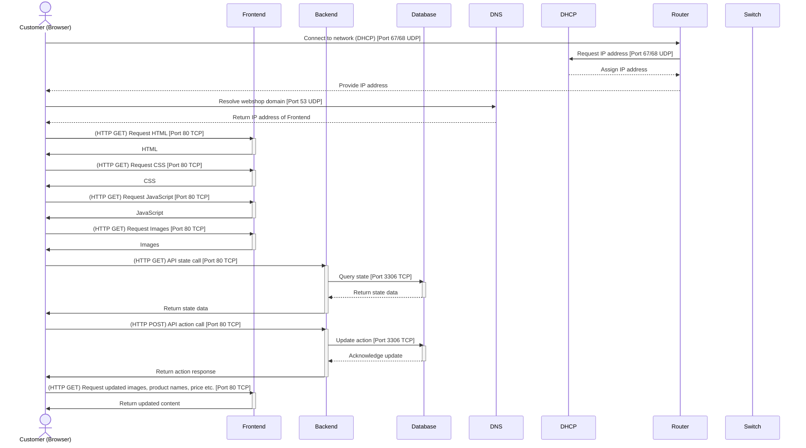

# Sequence Diagram

```mermaid

sequenceDiagram
    actor Customer (Browser)
    participant Frontend
    participant Backend
    participant Database
    participant DNS
    participant DHCP
    participant Router
    participant Switch

    Customer (Browser)->>Router: Connect to network (DHCP) [Port 67/68 UDP]
    Router->>DHCP: Request IP address [Port 67/68 UDP]
    DHCP-->>Router: Assign IP address
    Router-->>Customer (Browser): Provide IP address

    Customer (Browser)->>DNS: Resolve webshop domain [Port 53 UDP]
    DNS-->>Customer (Browser): Return IP address of Frontend

    Customer (Browser)->>Frontend: (HTTP GET) Request HTML [Port 80 TCP]
    activate Frontend
    Frontend->>Customer (Browser): HTML
    deactivate Frontend

    Customer (Browser)->>Frontend: (HTTP GET) Request CSS [Port 80 TCP]
    activate Frontend
    Frontend->>Customer (Browser): CSS
    deactivate Frontend

    Customer (Browser)->>Frontend: (HTTP GET) Request JavaScript [Port 80 TCP]
    activate Frontend
    Frontend->>Customer (Browser): JavaScript
    deactivate Frontend

    Customer (Browser)->>Frontend: (HTTP GET) Request Images [Port 80 TCP]
    activate Frontend
    Frontend->>Customer (Browser): Images
    deactivate Frontend

    Customer (Browser)->>Backend: (HTTP GET) API state call [Port 80 TCP]
    activate Backend
    Backend->>Database: Query state [Port 3306 TCP]
    activate Database
    Database-->>Backend: Return state data
    deactivate Database
    Backend->>Customer (Browser): Return state data
    deactivate Backend

    Customer (Browser)->>Backend: (HTTP POST) API action call [Port 80 TCP]
    activate Backend
    Backend->>Database: Update action [Port 3306 TCP]
    activate Database
    Database-->>Backend: Acknowledge update
    deactivate Database
    Backend->>Customer (Browser): Return action response
    deactivate Backend

    Customer (Browser)->>Frontend: (HTTP GET) Request updated images, product names, price etc. [Port 80 TCP]
    activate Frontend
    Frontend->>Customer (Browser): Return updated content
    deactivate Frontend


```
