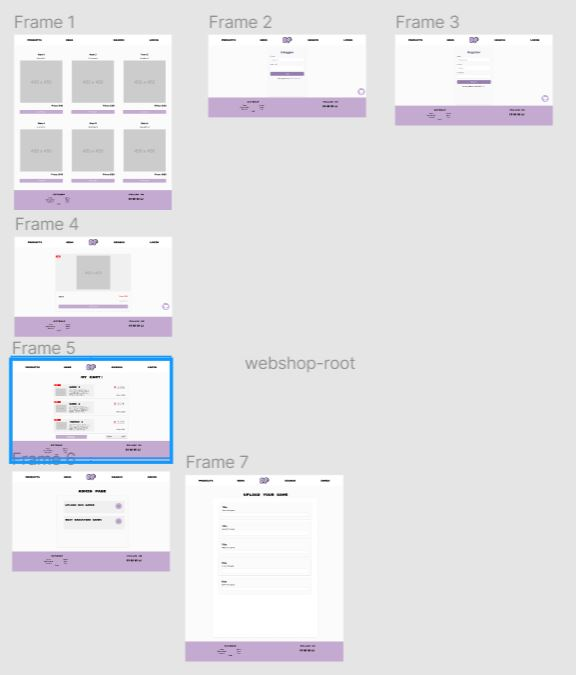

# Design Document

Process achter de logo, wij wouden een eigen ontwerp maken voor de site en wat individueliteit meebrengen. Dus hebben we een paar schetsen eerst papier gedaan. En daarna overgestapt naar een digitale versie. We hebben dat ook gedaan met de naam, onze site heet Don't Play. Het staat voor "Don't Play Start Slaying".

Originele design aangepast, het was eerst wat school ons gegeven had. Na meerdere revisies van de design die we wouden binnen de team, uiteindelijk voor 1 gekozen en aan de product owner laten zien.

Na deze was ingevoerd zijn we begonnen met Guerilla tests doen om te zien of het geoptimaliseerd kon worden. Of als er problemen mee waren, we hebben eruit gekregen om een paar dingen aantepassen die net fout waren zoals: Logo niet goed geknipt, navbalk was assymetrisch etc.. En hebben we dat aangepast. 

## Wireframes 
Wij hebben een wireframe uitgewerkt zodat we efficienter guerilla tests kunnen doen. 

