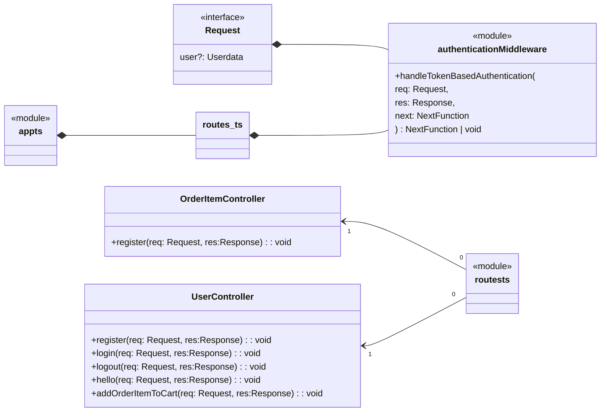
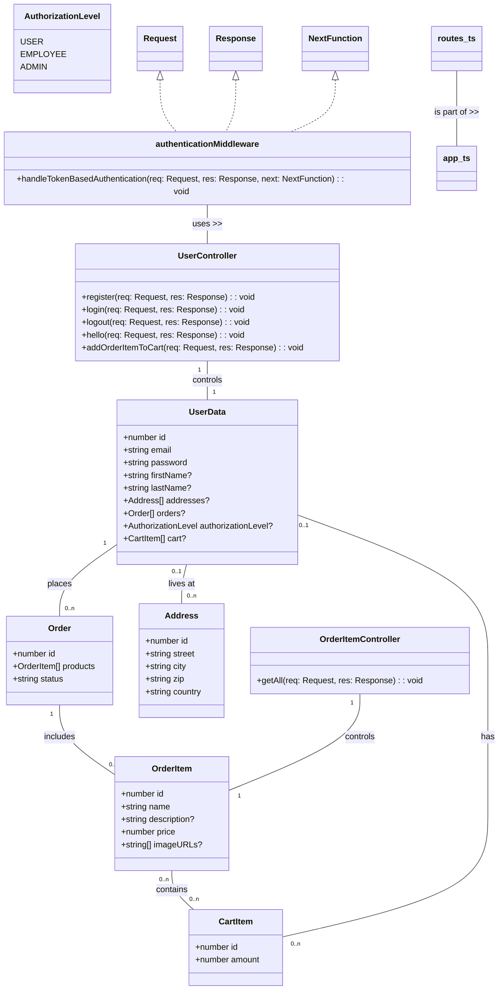

First draft Class Diagram backend

```mermaid
classDiagram
  direction RL

  class Request{
    <<interface>>
    user?: Userdata
  }

  class authenticationMiddleware{
    <<module>>
    +handleTokenBasedAuthentication(
      req: Request,
      res: Response,
      next: NextFunction
    ) : NextFunction | void
  }

  class routests{
    <<module>>
  }

  class appts{
    <<module>>
  }

  class UserController{
    +register(req: Request, res:Response): void
    +login(req: Request, res:Response): void
    +logout(req: Request, res:Response): void
    +hello(req: Request, res:Response): void
    +addOrderItemToCart(req: Request, res:Response): void
  }

  class OrderItemController{
    +register(req: Request, res:Response): void
  }


    authenticationMiddleware --* Request
    authenticationMiddleware --* routes_ts
    routes_ts --* appts
    routests "0" --> "1" OrderItemController
    routests "0" --> "1" UserController


    
```

```mermaid
 
classDiagram
  class OrderItem {
    +number id
    +string name
    +string description?
    +number price
    +string[] imageURLs?
  }
 
  class CartItem {
    +number id
    +number amount
  }
 
  class Order {
    +number id
    +OrderItem[] products
    +string status
  }
 
  class Address {
    +number id
    +string street
    +string city
    +string zip
    +string country
  }
 
  class UserData {
    +number id
    +string email
    +string password
    +string firstName?
    +string lastName?
    +Address[] addresses?
    +Order[] orders?
    +AuthorizationLevel authorizationLevel?
    +CartItem[] cart?
  }
 
  %% Enumeration for AuthorizationLevel
  class AuthorizationLevel {
    USER
    EMPLOYEE
    ADMIN
  }
 
  class OrderItemController {
    +getAll(req: Request, res: Response): void
  }
 
  class UserController {
    +register(req: Request, res: Response): void
    +login(req: Request, res: Response): void
    +logout(req: Request, res: Response): void
    +hello(req: Request, res: Response): void
    +addOrderItemToCart(req: Request, res: Response): void
  }
 
  class authenticationMiddleware {
    +handleTokenBasedAuthentication(req: Request, res: Response, next: NextFunction): void
  }
 
  %% Interfaces
  interface Request
  interface Response
  interface NextFunction
 
  %% Modules
  class routes_ts
  class app_ts
 
  %% Relations
  OrderItem "0..n" -- "0..n" CartItem : contains
  Order "1" -- "0..n" OrderItem : includes
  UserData "0..1" -- "0..n" CartItem : has
  UserData "1" -- "0..n" Order : places
  UserData "0..1" -- "0..n" Address : lives at
  OrderItemController "1" -- "1" OrderItem : controls
  UserController "1" -- "1" UserData : controls
  authenticationMiddleware -- UserController : uses >>
  Request <|.. authenticationMiddleware
  Response <|.. authenticationMiddleware
  NextFunction <|.. authenticationMiddleware
  routes_ts -- app_ts : is part of >>
 
```