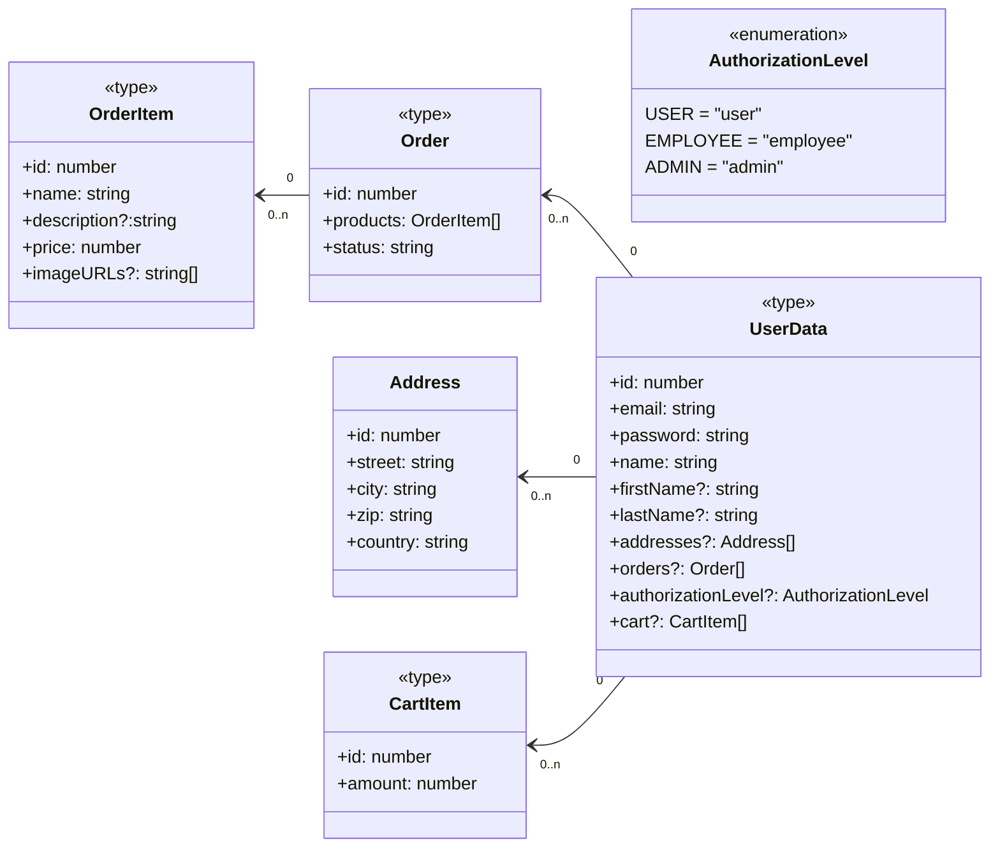

## First draft Class Diagram shared

```mermaid
classDiagram
  direction RL

  class Order {
    <<type>>
    +id: number
    +products: OrderItem[]
    +status: string
  }

  class OrderItem {
    <<type>>
    +id: number
    +name: string
    +description?:string
    +price: number
    +imageURLs?: string[]
  }

  class Address {
    +id: number
    +street: string
    +city: string
    +zip: string
    +country: string
  }

  class CartItem {
    <<type>>
    +id: number
    +amount: number
  }


class AuthorizationLevel {
    <<enumeration>>
    USER = "user"
    EMPLOYEE = "employee"
    ADMIN = "admin"
  }

  class UserData {
    <<type>>
    +id: number
    +email: string
    +password: string
    +name: string
    +firstName?: string
    +lastName?: string
    +addresses?: Address[]
    +orders?: Order[]
    +authorizationLevel?: AuthorizationLevel
    +cart?: CartItem[]
  }

    Order "0" --> "0..n" OrderItem
    UserData "0" --> "0..n" Order
    UserData "0" --> "0..n" Address
    UserData "0" --> "0..n" CartItem


```
